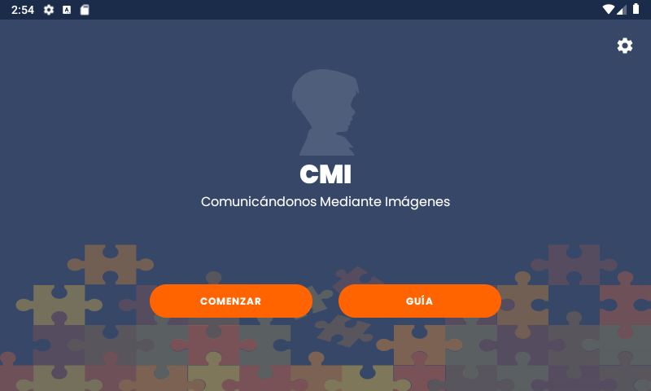
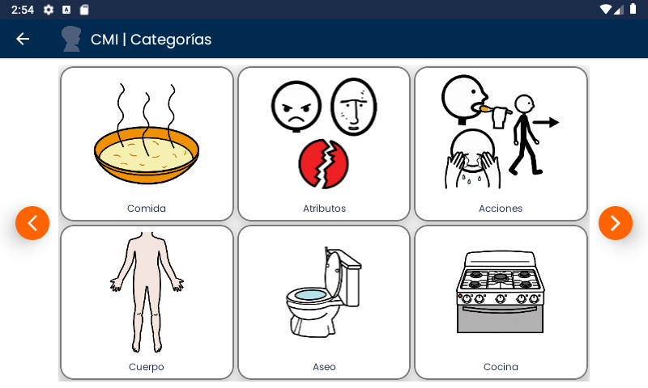
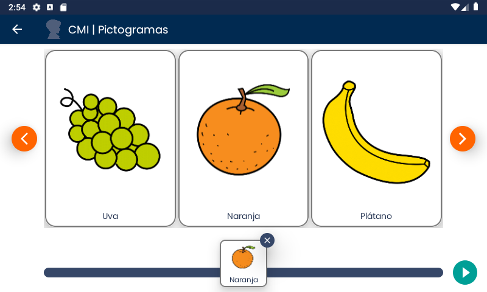
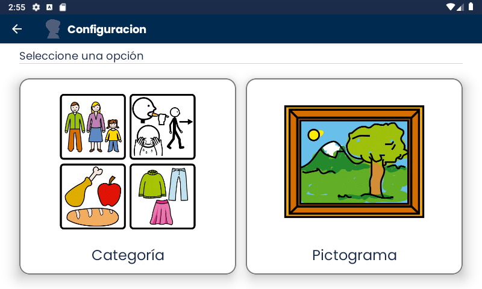
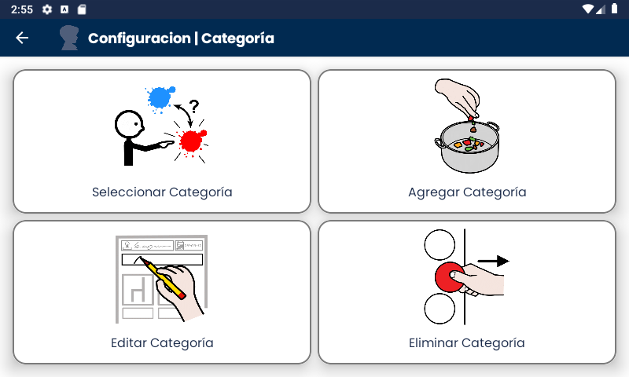

# Android-cmi-pecs
Android application that implements Picture Exchange Communication System (PECS) in order to support language teraphy to autism people.

### Description
CMI is an application with the main objective of serving as a support to help you increase communication skills in children with Autism Spectrum Disorder (ASD).

CMI is based on PECS (Image Exchange Based Communication System). Therefore, it allows the infant to develop communication based on six levels, one of the biggest feature in CMI is that from the two years of investigation, we decide to provide just a single Screen which can be used for the six levels, this feature add simplicity which is one of the targets that CMI provides. In addition, it allows adding and editing, adding, selecting and deleting  images to enrich the context of its use.

On the other hand, it can also be used by people who do not have an ASD but have difficulties to communicate. Also, you can check this [video](https://www.youtube.com/watch?v=jFqzmWQx_yg&t=7s) in Youtube that explain how it works and how you can use it.

### Screenshots

Name | Description | Image
--- | --- | ---
Intro | Intro for CMI - PECS App |  
Categories | Available Categories in CMI, these categories and other pictograms are from [ARASAAC](https://arasaac.org) |  
PECS | PECS Screen where you can select pictograms and interact with it | 
Config | Screen where you can init a configuration for Category or pictograms| 
Category Config | Options for Category Configurations( Select, Remove, Edit and Add) | 

## Features

   * Presentation, domain and data layer
   * koin as Dependency Injector
   * Retrofit as Http client
   * ViewBinding for binding views
   * Timber for show logs
   * Glide for loading images
   * Architecture components( LiveData, ViewModel and Room)

## Contribute

Feel free to contribute either by requesting features or collaborating with new content.

* [Clone the repo](https://github.com/RaulitoGC/android-cmi-pecs).
* Create a branch off of master and give it a meaningful name (e.g. feature/[FEATURE-NAME]).
* Open a pull request on GitHub and describe the feature, fix or post.

## Author
Raul Guzman - [@RaulitoGC](https://github.com/RaulitoGC) on GitHub, [@rguzmanc161](https://twitter.com/rguzmanc161) on Twitter

## License

The pictographic symbols used are the property of the Government of Aragón and have been created by Sergio Palao for ARASAAC (http://www.arasaac.org), that distributes them under Creative Commons License BY-NC-SA.

Shield: [![CC BY-SA 4.0][cc-by-sa-shield]][cc-by-sa]

This work is licensed under a
[Creative Commons Attribution-ShareAlike 4.0 International License][cc-by-sa].

[![CC BY-SA 4.0][cc-by-sa-image]][cc-by-sa]

[cc-by-sa]: http://creativecommons.org/licenses/by-sa/4.0/
[cc-by-sa-image]: https://licensebuttons.net/l/by-sa/4.0/88x31.png
[cc-by-sa-shield]: https://img.shields.io/badge/License-CC%20BY--SA%204.0-lightgrey.svg

